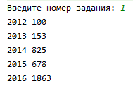
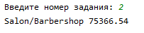
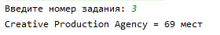
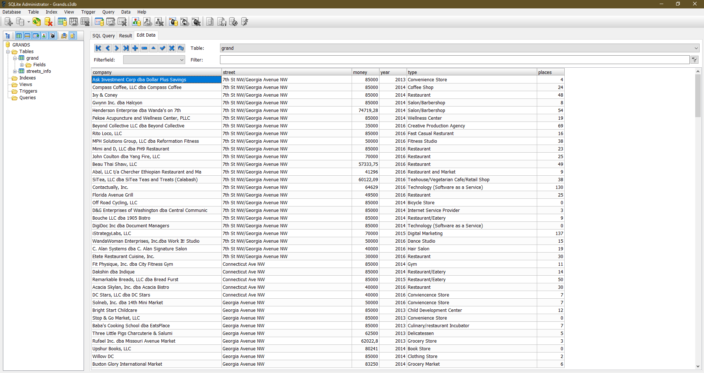
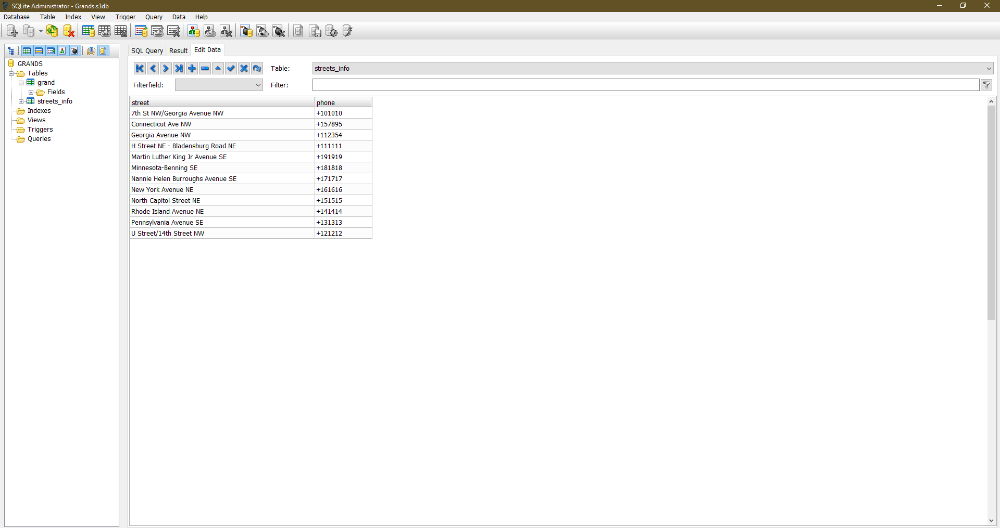
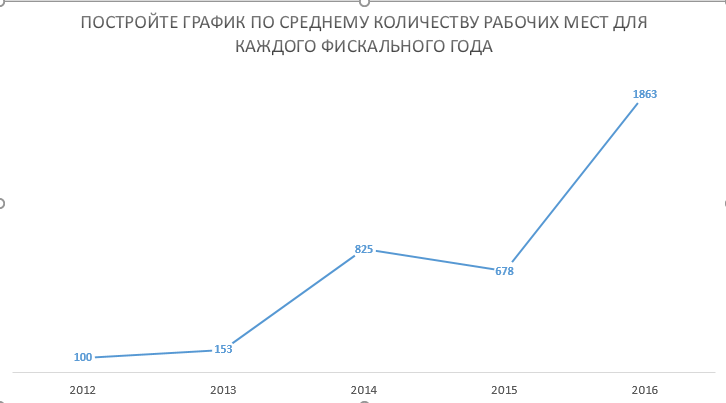

# JavaProject
Скачиваем csv-файл
Создаём java-проект и добавляем необходимые зависимости в maven-файл
Создаём класс csvReader, который отвечает за парсинг csv-файла, а также в будущем за отправку данных в наши бд
Создаём два класса для инициализации объектов
Заполняем объекты данными из csv
Скачиваем Sqlite и создаём там бд, где будут хранится две таблички по 3-ей нормальной форме
Создаём класс Conn для работы с бд
Создаём метод insert для заполнения бд информацией и csv-файла
Создаём три метода Task1,Task2,Task3 для решения задач нашего варианта
Все ответы заданий скриншотим и для первого задания делаем график в excel
Пишем всю последовательность действий в README.md, прикрепляя все скриншоты

